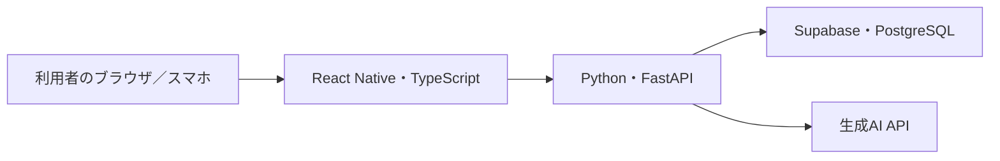

# ICTsol F1 技術仕様書

更新日：2026年10月5日。現在の実装と開発時の判断をまとめた資料です。未検証・未実装の項目は末尾に記載します。

## 1. アプリの目的

ユーザーが入力した調子、未完了タスク、使える時間、場所、予定をもとに、取り組みやすいタスクや休息を提案します。疲労度は自己申告の5択を利用します。医学的な診断や疲労度の自動推定は行いません。

アカウント登録、ログイン、タスクの登録・編集・完了切り替え、予定の取り込み、AI提案、取り組み・休息の選択履歴を実装しています。

## 2. システム構成

公開Web版はRender上のひとつのDockerコンテナで画面とAPIを配信します。画面は `/`、APIは `/api/` 以下を使用します。保存先はSupabaseのPostgreSQLです。DB接続URLと生成AIキーはバックエンドだけが保持します。

ローカル開発ではExpoの開発サーバーとFastAPIを別々に起動でき、保存先はSQLiteです。GitHub Pagesはログイン不要の画面確認デモ専用で、DB保存や実際のAI通信は行いません。

## 3. 使用技術

| 対象 | 技術 | 用途 |
| --- | --- | --- |
| 画面 | Expo SDK 57、React Native、React Native Web | スマホとブラウザの共通UI |
| 言語 | TypeScript、Python | 画面の型チェック、API処理 |
| API | FastAPI、Pydantic、Uvicorn | エンドポイント、入力検証、配信 |
| ローカル保存 | SQLite、Python標準のsqlite3 | 開発用ファイルDB |
| 公開時保存 | PostgreSQL、psycopg 3 | Supabase DBへのサーバー接続 |
| AI | OpenAI Python SDK、Responses API、Structured Outputs | 型に沿ったタスク候補と理由の生成 |
| 端末予定 | expo-calendar | 選択したカレンダーの読み取り |
| 公開 | Docker、Render、Supabase | サーバー配信と外部DB |
| 検証 | unittest、FastAPI TestClient、GitHub Actions | DB・認証・API・Web構成の確認 |

依存ライブラリの具体的なバージョンは `mobile/package.json`、`mobile/package-lock.json`、`backend/requirements.txt`を正とします。

## 4. コードの配置

| ファイル／フォルダ | 役割 |
| --- | --- |
| `mobile/Login.tsx` | 登録・ログイン・ログアウト、ユーザー切り替え |
| `mobile/Dashboard.tsx` | 調子、タスク、AI提案、選択履歴の画面 |
| `mobile/CalendarPanel.tsx` | 端末予定取り込み・Web手入力 |
| `mobile/api.ts` | 共通型、接続先、認証ヘッダー、通信エラー処理 |
| `mobile/demo.ts` | 外部通信しない閲覧用サンプル |
| `backend/app/main.py` | タスク・調子・履歴・提案API、Webファイル配信 |
| `backend/app/auth.py` | 認証、パスワード照合、セッション、試行制限 |
| `backend/app/database.py` | DB選択、接続、初期化、SQL互換処理 |
| `backend/app/calendar.py` | 予定API、同期範囲検証、空き時間計算 |
| `backend/app/recommendations.py` | AIリクエストと応答検証 |
| `backend/app/models.py` | 入力・出力の検証モデル |
| `backend/tests/` | 自動テスト |
| `Dockerfile`、`compose.yaml` | 画面＋APIのビルド・実行、ローカル永続ボリューム |
| `render.yaml` | Render無料Web Serviceの公開設定 |
| `.github/workflows/` | デモ配信とPR時の検証 |

## 5. 調子の入力とタスク

| 表示 | 保存値 |
| --- | --- |
| 少し疲れてる | `slightly_tired` |
| 疲れてる | `tired` |
| 普通 | `normal` |
| 少し元気 | `slightly_good` |
| 元気 | `good` |

画面上の順序は上表のとおりです。既存の `good`・`normal`・`tired` は引き続き使用できます。AIには保存値と日本語ラベルを送ります。

タスクはタイトル、所要時間（1〜1440分）、任意の締切、優先度、必要集中度、場所、完了状態を持ちます。優先度・集中度は `low`・`medium`・`high` の3段階です。場所が空欄ならどこでも実行できるタスクとして扱います。

## 6. DBと保存内容

`DATABASE_URL` があればPostgreSQL、空欄ならSQLiteを使います。公開時は `REQUIRE_DATABASE_URL=1` を指定し、設定漏れのまま一時ファイルに保存することを防ぎます。SQLiteの既存データをPostgreSQLへ自動移行する処理はありません。

PostgreSQLではアプリ専用の `ictsol` スキーマを使用します。SupabaseのData APIにこのスキーマを公開せず、利用者はFastAPIを経由してアクセスします。バックエンドのDB接続はSSLを既定で要求し、SupabaseのIPv4対応Session poolerを利用します。

| テーブル | 主な保存内容 |
| --- | --- |
| `users` | ユーザーID、ユーザー名、パスワードハッシュ |
| `sessions` | トークンのハッシュ、ユーザーID、有効期限 |
| `auth_attempts` | 試行制限用のハッシュ化した区分、回数、開始時刻 |
| `tasks` | 所有者、タスク情報、完了状態 |
| `user_conditions` | ユーザーごとの最新の調子、更新時刻 |
| `calendar_events` | 所有者、イベント識別子、開始・終了時刻 |
| `calendar_sync` | 所有者、取り込み時刻、同期対象期間 |
| `activities` | 所有者、選択したタスクID・名称、調子、選択時刻。タスクIDがNULLなら休息 |
| `conditions` | 旧版の匿名記録。現在のユーザー機能では使用しない |

履歴には選択時の名称・調子を保存し、タスク名を後から編集しても過去の履歴は変わりません。画面は直近50件を表示します。履歴は取り組む意思の記録であり、実際の実行や完了を保証しません。

旧匿名タスクは `tasks.user_id IS NULL` のまま保持し、新しいアカウントに自動で割り当てません。

DB更新はトランザクション内で行います。PostgreSQLでは自動採番と `RETURNING` を使い、DBエラーが発生した処理をロールバックします。ログイン試行回数の更新はPostgreSQLのトランザクション単位のadvisory lock、SQLiteの書き込みロックで直列化します。

SQL互換処理はアプリ内の固定SQLのプレースホルダーと初期化DDLに限定しています。利用者の入力はSQL文字列に埋め込まず、ドライバーへパラメーターとして渡します。

## 7. 認証とAPI

ユーザー名は英数字・`_`・`-` の3〜40文字で、大文字小文字を区別しません。パスワードは12〜128文字、保存時はランダムソルト付きscryptハッシュを使用します。

セッションの有効期限は24時間です。ランダムなトークンを画面のメモリに保持し、APIへ `Authorization: Bearer ...` を送ります。DBにはトークンそのものではなくSHA-256ハッシュを保存します。画面更新・アプリ終了後は再ログインが必要です。ログアウトで該当セッションを失効します。

| メソッド | パス | 内容 | 認証 |
| --- | --- | --- | --- |
| GET | `/api/health` | APIとDB接続の確認 | 不要 |
| GET | `/api/hello` | 接続確認のメッセージ | 不要 |
| POST | `/api/auth/register` | アカウント登録 | 不要 |
| POST | `/api/auth/login` | セッション発行 | 不要 |
| GET | `/api/auth/me` | 現在のユーザー | 必要 |
| POST | `/api/auth/logout` | セッション失効 | 必要 |
| GET | `/api/config` | AIが設定済みか確認 | 必要 |
| GET／POST | `/api/tasks` | 自分のタスク一覧／作成 | 必要 |
| PUT | `/api/tasks/{id}` | 自分のタスク編集 | 必要 |
| PATCH | `/api/tasks/{id}` | 自分のタスクの完了切り替え | 必要 |
| GET／PUT | `/api/condition` | 自分の調子の取得／保存 | 必要 |
| GET／PUT／DELETE | `/api/calendar` | 自分の取り込み予定の取得／置換／解除 | 必要 |
| POST | `/api/recommendations` | 時間・場所・予定に合う提案 | 必要 |
| GET／POST | `/api/activities` | 自分の選択履歴の取得／保存 | 必要 |

所有者は認証済みユーザーから決め、クライアントが指定するユーザーIDは使いません。他人のタスクへの操作は404で返します。完了済みのタスクを履歴に選択する操作は409で拒否します。履歴登録で `task_id: null` を明示すると休息を保存します。

登録・ログインは15分でユーザー名ごと10回、接続元IPごと60回までです。制限情報をDBに置くためサーバー再起動後も制限を維持します。API応答は `Cache-Control: no-store` とし、WebのCORS許可元を環境変数で指定します。公開用Web版は画面とAPIが同じURLです。

## 8. AI提案の流れ

1. 最新の調子を取得する。未入力なら409で終了する。
2. 予定を考慮する場合、利用可能な時間を計算する。
3. 本人の未完了タスクから所要時間・場所が合うものを絞る。
4. 締切・優先度で並べ、最大30件をAI候補にする。
5. 候補がなければAIを呼ばず、休息の案内を返す。
6. AIへ候補・調子・空き時間・場所を送り、最大3件の代替候補と理由、休息の理由を受け取る。
7. 型、重複ID、候補外ID、拒否、未完了応答を検証する。
8. AI処理中にタスク・調子・予定が変わった場合は409で再取得を求める。
9. タスクまたは休息を選択した時点で、本人の履歴に保存する。

候補はどれか1つを選ぶ代替案で、複数をまとめて実行する計画ではありません。タスク名や場所に含まれる文章をAIへの命令として扱わないよう指示しています。外部AIのエラーは日本語の一般的なメッセージに置き換え、生のエラーやキーは画面に返しません。

AI SDKのタイムアウトは25秒で自動再試行は無効、画面側の通信タイムアウトは35秒です。リクエストでは `store=False` を指定します。この指定はサービス全体の保持方針を保証するものではありません。

## 9. カレンダーとプライバシー

端末版ではユーザーが選択したカレンダーから今後7日分を読み取ります。端末に同期済みのGoogle・Apple等の予定も対象になります。Google等への直接OAuth連携は未実装です。

サーバーへ送るのは識別子と開始・終了時刻だけです。タイトル・説明・参加者は送りません。キャンセル済み・空き時間のイベントは除外し、終日予定はその期間を予定ありとして扱います。Web版は予定時間を手入力します。

取り込みはボタン操作時のみで、本人のスナップショット全体を置き換えます。同期対象期間の外や24時間以上前の取り込みは再同期を要求します。予定の最中は利用可能時間を0分、それ以外は入力時間と次の予定までの時間の短い方にします。AIには予定そのものではなく計算した空き時間を送ります。

端末カレンダーには開発ビルドが必要です。Expo GoやWebブラウザから端末カレンダーは読み取れません。

## 10. 環境変数・公開・検証

| 環境変数 | 設定先 | 用途 |
| --- | --- | --- |
| `DATABASE_URL` | バックエンド／Renderの秘密設定 | SupabaseのPostgreSQL接続URL |
| `REQUIRE_DATABASE_URL` | バックエンド | `1`で公開時の外部DB設定を必須にする |
| `DATABASE_PATH` | バックエンド | SQLiteファイルの保存先 |
| `OPENAI_API_KEY`／`OPENAI_MODEL` | バックエンドの秘密設定 | 実際のAI提案 |
| `CORS_ORIGINS` | バックエンド | Web画面の許可元 |
| `WEB_DIST_PATH`／`PORT` | 配信サーバー | 静的画面のフォルダ／待ち受けポート |
| `EXPO_PUBLIC_API_BASE_URL` | 画面のビルド時 | API接続先。`/`で同じURLを使う |
| `EXPO_PUBLIC_DEMO_MODE` | 画面のビルド時 | `1`は閲覧デモ、`0`は実際のAPIを使用 |
| `EXPO_WEB_BASE_URL` | 画面のビルド時 | GitHub Pagesのサブディレクトリ |
| `TEST_DATABASE_URL` | テスト時のみ | テスト専用PostgreSQL。DB名を `ictsol_test` に限定 |

`EXPO_PUBLIC_`の値は利用者が取得できるため、キーやDB接続URLを設定してはいけません。`.env`、DBファイル、仮想環境はGit・Dockerビルドへのコピー対象から除外します。

起動方法はREADME、公開方法は [公開手順](公開手順.md) を参照してください。自動テストは一時SQLiteまたはテスト用PostgreSQLと偽のAI応答を使用します。`verify_release.py`は画面とAPIの同時配信、非公開ファイルの保護、起動処理を再実行した後の保存、ログアウトを確認します。

## 11. 現時点の制限・今後の作業

- Render／Supabaseの実アカウントでのデプロイと、実際のAI通信は未確認。
- Dockerイメージの実ビルドとスマホ実機でのカレンダー確認は未実施。
- パスワード再設定、メール確認、ログイン状態の永続化は未実装。
- 通知、フィードバック学習、課金、ストア配布は未実装。
- SQLiteからSupabaseへの既存データ移行、定期バックアップと復旧手順は未実装。
- 依存関係の監査で検出済みの問題はREADMEの監査メモを参照。
- 無料プランには休止や利用量の制限があり、常時稼働を保証しない。

この資料は一般公開向けの完成を保証するものではありません。チームで実機確認・AI応答確認・公開先の設定確認を行い、必要な運用機能を完成させます。
